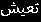
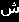
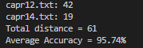

# **Arabic OCR for GCC**


- OCR system for the Arabic language that converts images of typed text to machine-encoded text.<br>
- The system aims to solve a simpler problem of OCR with images that contain only Arabic characters (check the dataset link below to see a sample of the images).

## Important Note
> The system currently supports only letters (29 letters) ا-ى , لا (no numbers or special symbols).

## Setup

Install Python, then run this command:

```shell
pip install -r requirements.txt
```

## Run

1. Put the images in the `src/test` directory.
2. Go to the `src` directory and run the following command:
   ```shell
   python OCR.py
   ```
3. An output folder will be created with:
   - A `text` folder containing text files corresponding to the images.
   - A `running_time` file that logs the time taken to process each image.

## Pipeline


## Dataset

- Link to the dataset of images and the corresponding text: [here](https://drive.google.com/open?id=1Nbp9ZXLlWV3n8yRMwj2gjs_rE6qGZU01).
- We used 1000 images to generate the character dataset that we used for training.

# Examples

## Line Segmentation


## Word Segmentation



## Character Segmentation




# Testing

**NOTE**: Make sure you have a folder with the truth output with the same file names to compare it with the predicted text.

From within the `src` folder, run:

```shell
python edit.py 'output/text' 'truth'
```



# Performance

- Average accuracy: 95%.
- Average time per image: 16 seconds.

---

**NOTE**

We achieved these results when we used only the flattened image as a feature.

---

# References

1. [An Efficient, Font Independent Word and Character Segmentation Algorithm for Printed Arabic Text](https://www.researchgate.net/publication/335562626_An_Efficient_Font_Independent_Word_and_Character_Segmentation_Algorithm_for_Printed_Arabic_Text).

2. [A Robust Line Segmentation Algorithm for Arabic Printed Text with Diacritics](https://www.researchgate.net/publication/317876029_A_Robust_Line_Segmentation_Algorithm_for_Arabic_Printed_Text_with_Diacritics).

3. [Arabic Character Segmentation Using Projection Based Approach with Profile's Amplitude Filter](https://www.researchgate.net/publication/318205989_Arabic_Character_Segmentation_Using_Projection_Based_Approach_with_Profile's_Amplitude_Filter).

4. [A Review of Optical Character Recognition Technology for Arabic Text](https://www.researchgate.net/publication/331981078_A_Review_of_Optical_Character_Recognition_Technology_for_Arabic_Text).

5. [Arabic Optical Character Recognition: A Review](https://www.sciencedirect.com/science/article/abs/pii/S1877050919315971).
